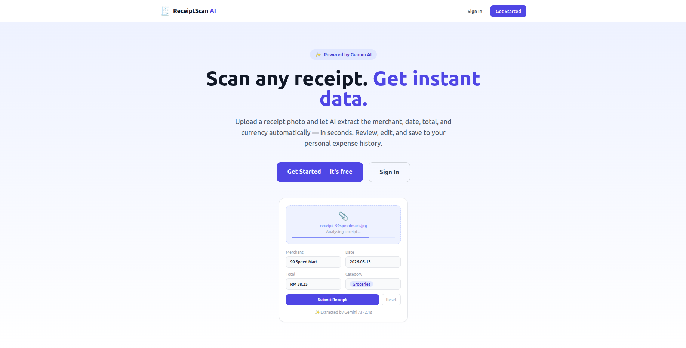
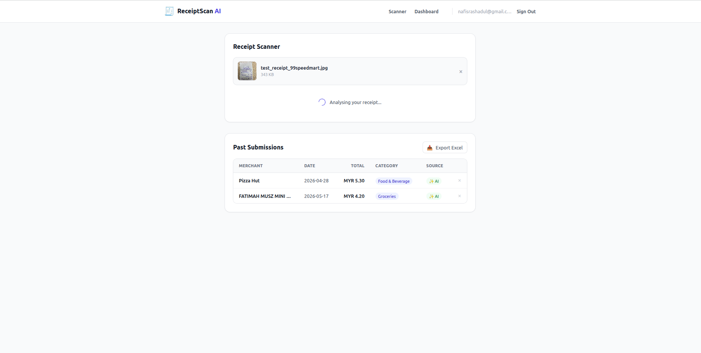
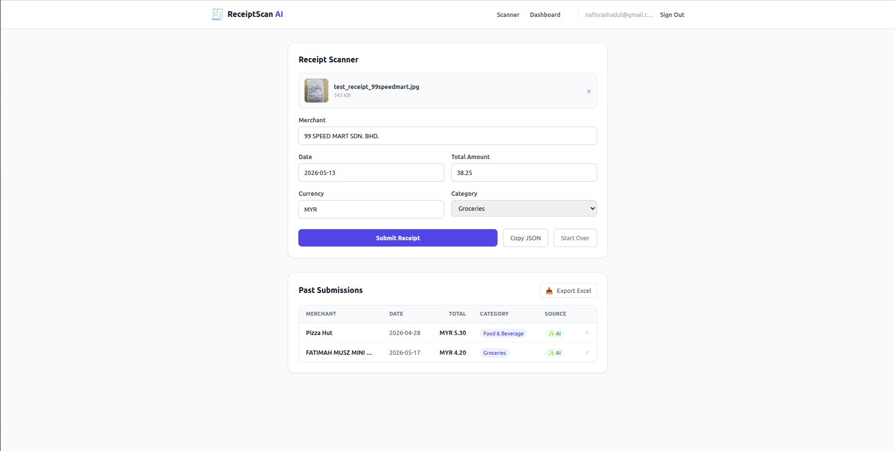
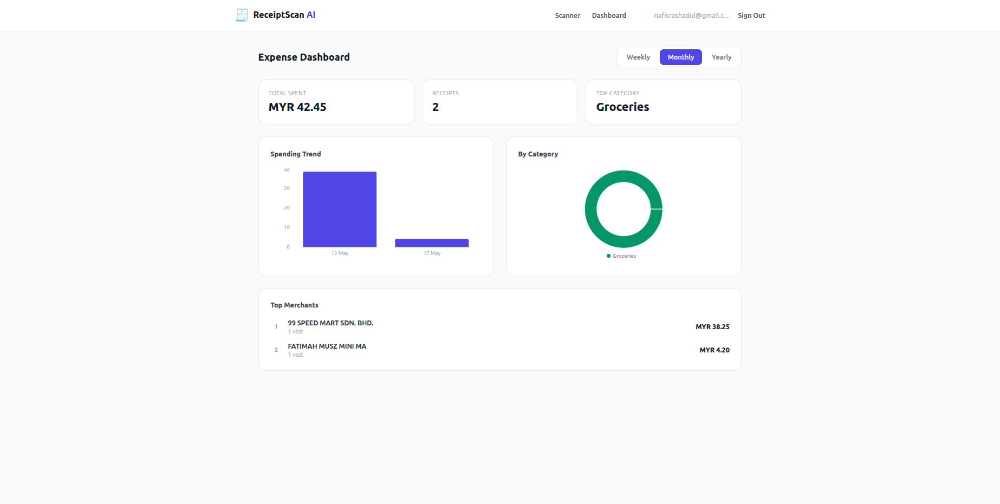
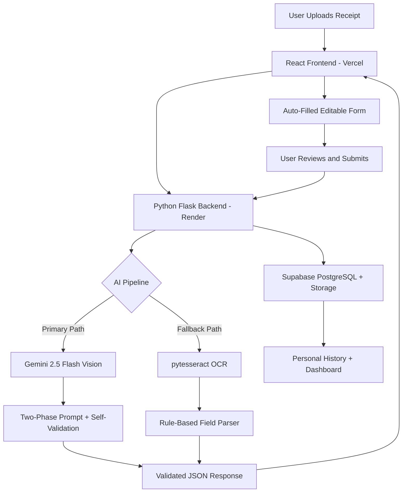

# ReceiptScan AI

AI-powered full-stack web application that extracts structured expense data from receipt images using Google Gemini Vision and automatically fills an editable form.

---

## 🚀 Demo

**Live App:** [https://recipet-scan-ai-frontend.vercel.app/](https://recipet-scan-ai-frontend.vercel.app/)

**Demo Video:** Coming Soon

<table>
  <tr>
    <td align="center">
      
      <br/>
      <em>Landing Page</em>
    </td>
    <td align="center">
      
      <br/>
      <em>AI Analysing Receipt</em>
    </td>
  </tr>
  <tr>
    <td align="center">
      
      <br/>
      <em>Auto-Filled Form</em>
    </td>
    <td align="center">
      
      <br/>
      <em>Expense Dashboard</em>
    </td>
  </tr>
</table>

---

##  Problem

Manually entering receipt data is repetitive, time-consuming, and error-prone — particularly for anyone tracking personal or business expenses. People often misread totals, dates, or merchant names when transcribing by hand, leading to inaccurate expense records. This project demonstrates how generative AI can automate document understanding workflows end-to-end, turning unstructured receipt images into clean, structured expense data automatically.

---

##  Solution

The user simply uploads a photo of any receipt — crumpled, blurry, handwritten, or printed in any language. Google Gemini Vision AI reads and understands the receipt exactly like a human would, identifying the layout, language, and relevant fields. It extracts the merchant name, transaction date, total amount, currency, and expense category, normalising every value into a consistent format. The extracted data auto-fills an editable form so the user can review and correct any field before saving. Every submitted receipt is stored in the user's personal expense history and feeds an analytics dashboard with spending trends, category breakdowns, and top merchant rankings.

---

##  Features

- ✅ Upload receipt images via drag-and-drop (JPG, PNG, WEBP)
- ✅ AI extraction using Google Gemini 2.5 Flash Vision
- ✅ Two-phase prompt with self-validation loop
- ✅ Reads any date format, always outputs YYYY-MM-DD
- ✅ Confidence-driven UI — date picker shown for ambiguous dates, currency dropdown shown when currency is inferred
- ✅ OCR fallback (pytesseract) when Gemini is unavailable
- ✅ Batch upload — process multiple receipts in one session
- ✅ Secure user accounts — each user sees only their own data
- ✅ Supabase Row Level Security enforced at database level
- ✅ Analytics dashboard with spending trends, category breakdown, and top merchant rankings
- ✅ Filterable by Weekly / Monthly / Yearly
- ✅ Excel export — download full receipt history as .xlsx
- ✅ Responsive and mobile-friendly design

---

##  System Architecture



**Frontend (React + Vite):** Single-page application served from Vercel. Handles all UI rendering, drag-and-drop uploads, form state, confidence-driven input switching, batch file queuing, and chart visualisation via Recharts. Communicates with the backend exclusively through authenticated REST API calls.

**Backend (Python Flask):** REST API deployed on Render. Owns the entire AI pipeline — image preprocessing, Gemini API calls, retry logic, OCR fallback, JSON validation, and response normalisation. All database writes and reads go through the Flask backend using the Supabase service role key, never directly from the browser.

**Data (Supabase):** PostgreSQL database stores receipt records with Row Level Security enforced at the database level. Supabase Auth issues ES256 JWTs verified server-side on every protected request. Supabase Storage holds receipt images keyed by user ID.

---

##  Tech Stack

| Layer | Technology | Purpose |
|---|---|---|
| Frontend | React 18 + Vite | SPA with component-based UI |
| Styling | Tailwind CSS | Utility-first responsive design |
| Backend | Python 3.11 + Flask | REST API + AI pipeline |
| AI Model | Google Gemini 2.5 Flash | Vision-based receipt extraction |
| OCR Fallback | pytesseract + Pillow | Offline fallback extraction |
| Database | Supabase (PostgreSQL) | Persistent receipt storage |
| Auth | Supabase Auth (JWT) | Secure user authentication |
| Storage | Supabase Storage | Receipt image storage |
| Charts | Recharts | Analytics visualisations |
| Excel | SheetJS (xlsx) | Excel export |
| Frontend Deploy | Vercel | Frontend hosting |
| Backend Deploy | Render | Backend hosting |

---

##  AI Extraction Pipeline

1. User uploads receipt image (JPG, PNG, WEBP)
2. Flask backend preprocesses image using Pillow — resize to max 1200px on the longest side, mild contrast enhancement (1.2×) to improve legibility without distorting colours
3. PIL Image sent to Gemini 2.5 Flash with a two-phase structured prompt
4. **Phase 1 — Read and understand:** Gemini reads the full receipt structure, identifies the language, layout, and receipt type, and locates what to ignore (subtotals, cash tendered, change, rounding adjustments) before extracting anything
5. **Phase 2 — Extract and normalise:** Extracts exactly 5 fields and normalises them — merchant (brand name preferred over legal entity), date (→ YYYY-MM-DD regardless of input format), total (plain number, never the change or subtotal), currency (→ ISO 3-letter code inferred from symbols and context), category (from a fixed 13-category taxonomy)
6. **Self-validation step:** Gemini checks its own output against 6 rules before returning. If any field fails validation, it re-reads the receipt and corrects before output
7. Backend validates the returned JSON schema. If Gemini fails for any reason (quota exceeded, malformed JSON, API error), pytesseract OCR fallback activates automatically with no user intervention
8. Confidence flags (`date_confidence`, `currency_confidence`) are returned with the extraction. When either is `"low"`, the frontend switches from a plain text input to a date picker or currency dropdown and shows a "Please verify" label
9. Validated JSON returned to frontend — the form auto-fills instantly with all extracted values

---

##  Prompt Engineering

The extraction prompt was carefully engineered to handle real-world receipt complexity. Most receipt extraction fails because models grab the subtotal, cash tendered, or change instead of the actual total. The prompt uses a two-phase approach with explicit constraint rules and self-validation, mirroring how a human expert reads a receipt before transcribing it.

### Key Design Decisions

- **Two-phase reasoning:** Gemini reads and understands first, then extracts — mirrors how a human reads a receipt rather than scanning for numbers immediately
- **Explicit NOT list for total:** Subtotal, tax, cash tendered, change, and rounding adjustment are all named as wrong answers, preventing the most common extraction error
- **Date normalisation:** Any input format → YYYY-MM-DD with context-priority resolution (country/region → currency → logical plausibility) for ambiguous formats
- **Confidence flags:** `date_confidence` and `currency_confidence` drive UI widgets invisibly — the user sees a helpful calendar picker or currency dropdown, never a confusing confidence score
- **13-category taxonomy:** Specific enough to be useful for analytics GROUP BY queries, constrained enough to ensure consistent categorisation across receipts
- **Self-validation loop:** Gemini checks its own output against 6 rules before returning, reducing hallucination and JSON malformation on difficult receipts

### Extraction Prompt

```text
You are an expert receipt analyst with deep knowledge of receipt
formats from around the world. You read receipts carefully and
methodically before extracting any data.

STEP 1 — READ AND UNDERSTAND THE RECEIPT FIRST:
Before extracting anything, read the entire receipt like a human
would. Identify:
  - The type of receipt (restaurant, retail, transport, etc.)
  - The language(s) used on the receipt
  - Where the merchant name appears (header, logo, top lines)
  - Where the transaction date appears
  - Where the FINAL total appears — this is the amount the customer
    owes or paid, NOT:
      × The subtotal before tax
      × The tax amount
      × The cash amount tendered by the customer
      × The change returned to the customer
      × Any rounding adjustment (e.g. 0.02 sen rounding in Malaysia)
  - What currency is used (from symbols, context, or language)

STEP 2 — EXTRACT AND NORMALISE:
Extract exactly these fields:

merchant:
  The official business or store name.
  Scan the ENTIRE receipt — do not limit search to the header.
  Check these areas in order of priority:
    1. Header or top section (most common location)
    2. Any field labelled "Store Name:", "Merchant:", "Outlet:",
       "Business:" appearing anywhere on the receipt
    3. Brand name or logo text visible on the receipt
    4. Address block (business name often precedes the address)
    5. Footer lines such as "Thank you for visiting [Name]"
  Use the most official, recognisable business name found.
  If both a brand name (e.g. "Pizza Hut") and a legal entity
  name (e.g. "PHD Delivery Sdn Bhd") are present, prefer
  the brand name — it is more useful to the user.

date:
  The transaction date. Receipts print dates in many formats.
  Your job is to READ the format as written, UNDERSTAND it in
  context, and ALWAYS output in YYYY-MM-DD regardless of input.

  Formats you will encounter (non-exhaustive):
    DD-MM-YYYY   →  "15-05-2026"  →  output "2026-05-15"
    DD/MM/YYYY   →  "15/05/2026"  →  output "2026-05-15"
    MM/DD/YYYY   →  "05/15/2026"  →  output "2026-05-15"
    DD MMM YYYY  →  "15 May 2026" →  output "2026-05-15"
    YYYY-MM-DD   →  already ISO   →  output as-is
    DD-MM-YY     →  "15-05-26"    →  interpret year as 2026

  For ambiguous numeric formats (e.g. "03/04/26" — day-first or
  month-first?), resolve using context clues in this order:
    1. Country/region indicated by address or language on receipt
    2. Currency (e.g. MYR receipt → Malaysia → DD/MM/YY convention)
    3. Logical plausibility (e.g. month "13" is impossible → other
       number must be the month)
    4. If still genuinely uncertain after all context: pick the most
       plausible interpretation AND set date_confidence to "low"

  Set date_confidence to "high" when date is unambiguously stated.
  Set date_confidence to "low" ONLY when the format is genuinely
  ambiguous after applying all context clues above. Most receipts
  will have high confidence — low should be the exception.

total:
  The final amount charged to the customer.
  This is the bottom-line payable total — the number just above
  or beside labels like "TOTAL", "JUMLAH", "合計", "AMOUNT DUE",
  "TOTAL AMOUNT", "NET TOTAL".
  Output as a plain number (e.g. 15.90), never as a string.

currency:
  The 3-letter ISO 4217 currency code.
  Infer from symbols and context:
    RM or MYR → MYR
    $ (in Malaysian context) → MYR
    $ (in US context) → USD
    $ (in Singapore context) → SGD
    £ → GBP
    € → EUR
    ¥ → JPY or CNY (use address/language to distinguish)
  If currency is truly unidentifiable → "UNKNOWN"
  Set currency_confidence to "low" if inferred rather than explicit.

category:
  Infer the expense category from the merchant name, receipt
  type, and items purchased. Choose exactly one from this list:

    Food & Beverage   — restaurants, cafes, mamak, fast food, dine-in
    Groceries         — supermarkets, mini marts, convenience stores
    Transport         — ride-hailing, taxi, bus, train, parking, toll
    Petrol & Fuel     — petrol stations (Shell, Petronas, BHP, etc.)
    Shopping          — clothing, electronics, general retail
    Healthcare        — pharmacy, clinic, hospital, dental
    Beauty & Wellness — salon, spa, gym, personal care products
    Entertainment     — movies, events, karaoke, theme parks, games
    Accommodation     — hotels, Airbnb, serviced apartments
    Utilities         — telco, electricity, water, internet bills
    Education         — books, tuition fees, courses, stationery
    Office Supplies   — printing, office equipment, business expenses
    Other             — anything that does not fit the above

  Use your full understanding of the merchant and receipt content.
  Do not default to Other unless genuinely no other category fits.

date_confidence:
  "high" if the date is clearly and unambiguously stated.
  "low" if the date format is ambiguous or partially legible.

currency_confidence:
  "high" if currency is explicitly stated on the receipt.
  "low" if it was inferred from context.

STEP 3 — VALIDATE BEFORE RETURNING:
Check every field before outputting:
  ✓ total is a number, not a string
  ✓ date is exactly YYYY-MM-DD format
  ✓ currency is exactly 3 uppercase letters (or "UNKNOWN")
  ✓ merchant is not empty or null
  ✓ total is NOT the change amount, cash tendered, or rounding adj
  ✓ category is exactly one value from the allowed list
If any check fails: re-read the receipt and correct before output.

FINAL OUTPUT:
Return ONLY this JSON object. No markdown. No explanation.
No additional keys. No text before or after the JSON.

{
  "merchant": "string",
  "date": "YYYY-MM-DD",
  "total": number,
  "currency": "string",
  "category": "string",
  "date_confidence": "high" or "low",
  "currency_confidence": "high" or "low"
}
```

---

##  Security Considerations

- API keys stored exclusively in server-side environment variables — never exposed to the browser or committed to Git
- All AI API calls routed through the Flask backend — the frontend never calls Gemini directly
- Supabase Row Level Security (RLS) enforced at the database level — users can only read, write, and delete their own records
- JWT tokens verified server-side on every protected request using PyJWT with the Supabase JWT secret
- ES256 and HS256 JWT algorithms both supported — handles both legacy and modern Supabase JWT formats
- CORS configured to accept requests only from the known frontend domain
- File type and size validation on both client and server (JPG, PNG, WEBP only, max 10MB)

---

##  Error Handling

| Scenario | Behaviour |
|---|---|
| Gemini API rate limit | Retries up to 3 times with exponential backoff (1s, 2s, 4s) |
| Gemini API failure | Automatic fallback to pytesseract OCR |
| OCR fallback used | Yellow FallbackBanner shown, all fields flagged for verification |
| Unreadable receipt | Clear error message with retry prompt |
| Invalid file type | Client-side rejection before any API call |
| File too large (>10MB) | Rejected with size error message |
| Malformed AI response | JSON validation catches it, fallback triggered |
| Expired JWT token | 401 returned, user redirected to sign in |
| Unauthorised delete | 403 returned, ownership verified before deletion |
| Ambiguous date | Date picker shown, pre-filled with AI best guess |

---

##  How to Run Locally

### Prerequisites

- Python 3.11+
- Node.js 18+
- Tesseract OCR binary: `sudo apt install tesseract-ocr`
- Free Supabase project: [supabase.com](https://supabase.com)
- Free Gemini API key: [aistudio.google.com](https://aistudio.google.com) (no credit card required)

### 1. Clone Repository

```bash
git clone https://github.com/RashadulRD786/RecipetScan-AI.git
cd RecipetScan-AI
```

### 2. Backend Setup

```bash
cd backend
python3 -m venv venv
source venv/bin/activate
pip install -r requirements.txt
cp .env.example .env
# Fill in .env with your keys (see Environment Variables below)
```

### 3. Database Setup

Open the Supabase SQL Editor for your project and run the following:

```sql
CREATE TABLE receipts (
  id UUID DEFAULT gen_random_uuid() PRIMARY KEY,
  user_id UUID REFERENCES auth.users(id) ON DELETE CASCADE NOT NULL,
  merchant TEXT NOT NULL,
  date DATE NOT NULL,
  total NUMERIC(10, 2) NOT NULL,
  currency TEXT NOT NULL DEFAULT 'MYR',
  category TEXT NOT NULL DEFAULT 'Other',
  source TEXT NOT NULL DEFAULT 'gemini',
  image_url TEXT,
  created_at TIMESTAMPTZ DEFAULT NOW() NOT NULL
);

CREATE INDEX receipts_user_id_idx ON receipts(user_id);
CREATE INDEX receipts_created_at_idx ON receipts(created_at DESC);

ALTER TABLE receipts ENABLE ROW LEVEL SECURITY;

CREATE POLICY "Users can view their own receipts"
  ON receipts FOR SELECT
  USING (auth.uid() = user_id);

CREATE POLICY "Users can insert their own receipts"
  ON receipts FOR INSERT
  WITH CHECK (auth.uid() = user_id);

CREATE POLICY "Users can delete their own receipts"
  ON receipts FOR DELETE
  USING (auth.uid() = user_id);
```

Also create a Supabase Storage bucket named `receipts` with private access.

### 4. Frontend Setup

```bash
cd ../frontend
npm install
cp .env.example .env
# Fill in .env with your Supabase URL and anon key
```

### 5. Run Both Servers

**Terminal 1 — Backend:**

```bash
cd backend
source venv/bin/activate
flask run
```

**Terminal 2 — Frontend:**

```bash
cd frontend
npm run dev
```

Frontend runs at `http://localhost:5173` — backend at `http://localhost:5000`.

### Environment Variables

**`backend/.env`**

| Variable | Description |
|---|---|
| `GEMINI_API_KEY` | Google Gemini API key from AI Studio |
| `SUPABASE_URL` | Your Supabase project URL (e.g. `https://xxxx.supabase.co`) |
| `SUPABASE_SERVICE_KEY` | Supabase service role key (bypasses RLS — server-side only) |
| `SUPABASE_JWT_SECRET` | JWT secret from Supabase project settings |
| `FLASK_ENV` | `development` for local, `production` for deploy |
| `CORS_ORIGINS` | Allowed frontend origin (e.g. `http://localhost:5173`) |

**`frontend/.env`**

| Variable | Description |
|---|---|
| `VITE_API_URL` | Backend URL (e.g. `http://localhost:5000`) |
| `VITE_SUPABASE_URL` | Your Supabase project URL |
| `VITE_SUPABASE_ANON_KEY` | Supabase anon/public key (safe for browser) |

---

##  Deployment

### Backend (Render)

1. Connect your GitHub repo to Render and create a new **Web Service**
2. Set **Runtime** to Python 3, **Root Directory** to `backend`
3. **Build command:** `pip install -r requirements.txt`
4. **Start command:** `gunicorn app:app --workers 2 --timeout 120`
5. Add the following environment variables in the Render dashboard:
   - `GEMINI_API_KEY`
   - `SUPABASE_URL`
   - `SUPABASE_SERVICE_KEY`
   - `SUPABASE_JWT_SECRET`
   - `CORS_ORIGINS` (set to your Vercel frontend URL)

> **Note:** Render free tier cold-starts take 20–30 seconds after inactivity. Visit `/api/health` before demoing to wake the server.

### Frontend (Vercel)

1. Connect your GitHub repo to Vercel
2. Set **Framework** to Vite and **Root Directory** to `frontend`
3. Add the following environment variables in the Vercel dashboard:
   - `VITE_API_URL` (your Render backend URL)
   - `VITE_SUPABASE_URL`
   - `VITE_SUPABASE_ANON_KEY`
4. Vercel auto-deploys on every push to the `main` branch

---

## Future Improvements

- Replace pytesseract with EasyOCR for significantly improved OCR fallback accuracy on real-world receipts
- Celery + Redis task queue for concurrent AI processing at scale without hitting API rate limits
- Redis caching for analytics dashboard queries (TTL 1 hour, invalidated on new submission)
- Multi-currency normalisation with live exchange rates API
- Receipt sharing via expiring signed URLs
- Fine-tuned extraction model on Malaysian receipt dataset

---

## 📄 License

MIT License — feel free to use and modify.
